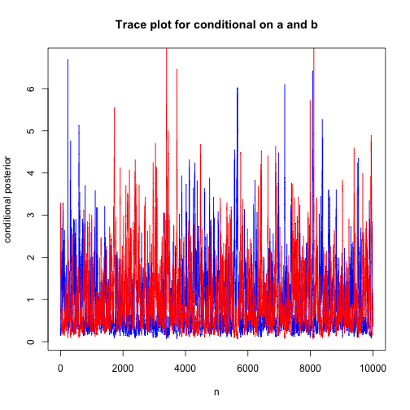
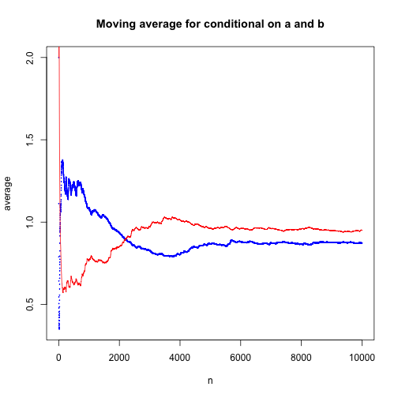

Teaching Bayes: A Gibbs Sampling Lab with Solutions
================================================
author: Rebecca C. Steorts
date: June 11, 2016
width: 1440
height: 900

Exponential Model
================================================
- Consider the following Exponential model for multiple observation(s) $x = (x_1\ldots,x_n)$. 
- Please note that in the attached data there are 40 observations

$$ p(x|a,b) = a b \exp(- a b x) I(x>0)$$

and suppose the prior is 

$$ p(a,b) = \exp(- a - b)I(a,b>0). $$

You want to sample from the posterior $p(a,b|x)$.  

Goals and Tasks
================================================
- Task 1: Find the conditional distributions needed for implementing a Gibbs sampler.
- Task 2: Code up your own Gibbs sampler in Task 1.
- Task 3: Plot a histogram or a density estimate of the estimated posterior in Task 2. 
- Task 4: How do you know that your estimated posterior in Task 3 is reliable? Provide convergence diagnostic plots and commentary. 

Task 1: Conditional distributions
================================================
This part is worked out in a supplementary document (and we would recommend do this part not in the lab but in class). 

It is easy to show: 

$$a|\boldsymbol{x},b \sim \text{Gamma}\left(\text{shape}= n+1, \text{rate}= b\sum_{i=1}^n x_i +1\right).$$

By symmetry:

$$b|\boldsymbol{x},a \sim \text{Gamma}\left(\text{shape} = n+1,\text{rate} = a\sum_{i=1}^n x_i +1\right).$$  

Task 1: Conditional distributions
================================================
Assuming that the observations are independent, we have
$$
\begin{aligned}
p(x|a,b) &= \prod_{i=1}^n p(x_i|a,b) \\
&= \prod_{i=1}^n ab\exp(-abx_i) \\
&= (ab)^n\exp\left(-ab\sum_{i=1}^nx_i\right).
\end{aligned}
$$

Task 1: Conditional distributions 
================================================
The function is symmetric for $a$ and $b$, implying:
$$
\begin{aligned}
p(a|x,b) &\propto_a p(a,b,\boldsymbol{x}) \\
&= p(x|a,b)p(a,b) \\
&=(ab)^n\exp\left(-ab\sum_{i=1}^nx_i\right)\left(\exp(-a-b)I(a,b>0)\right) \\
&= a^nb^n\exp\left(-ab\sum_{i=1}^n x_i \right)\exp(-a)\exp(-b)I(a,b>0) \\
&\propto_a a^n \exp\left(-a\left(b\sum_{i=1}^n x_i +1\right)\right)I(a>0),
\end{aligned}
$$

Task 1: Conditional distributions 
================================================
- The last line is the kernel of a Gamma distribution with shape $n+1$ and rate $b\sum_{i=1}^n x_i +1$.  
- This completes the derivation. 


Task 2: Gibbs sampler
================================================

```r
# read in the data #
require("MASS")
dataExp = read.csv("Assignment4Exponential.csv", header = FALSE)
# check number of observations in 30 #
nrow(dataExp)
```

```
[1] 30
```

```r
# set seed for reproducibility #
set.seed(123)
```

Task 2: Gibbs sampler (continued)
================================================

```r
######################################
### Function: gibbs sampling exp ###
### Inputs: number of sims,       ###
### a & b values and input data ###
######################################
eGibbs <- function(nSims, a, b, Dat) {
  # define n as number of data points #
  n = nrow(Dat)
  # define x as sum of data points #
  x = sum(Dat)
  # create matrix for results #
  results = matrix(NA, nrow = nSims, ncol = 2)
  # set starting points #
  results[1,] = c(a,b)
  for (i in 1:(nSims-1)) {
    results[i+1,1] = rgamma(1, shape = n+1, rate = 1 + x*results[i, 2])
    results[i+1,2] = rgamma(1, shape = n+1, rate = 1 + x*results[i+1, 1])
  }
  colnames(results) = c("conditionalA", "conditionalB")
  return(results)
}
```

Task 2: Gibbs sampler (continued)
================================================

```r
condPost = eGibbs(nSims = 10000, a = 2, b = 2, Dat = dataExp)
print(head(condPost))
```

```
     conditionalA conditionalB
[1,]    2.0000000     2.000000
[2,]    0.2256944     2.558473
[3,]    0.1407291     3.286799
[4,]    0.2040700     2.484330
[5,]    0.1583486     2.055166
[6,]    0.3008305     1.696736
```

Task 3: Joint Posterior Density
================================================
We plot the joint posterior density below using a contour plot. 


Task 3: Marginal Posterior of A and B 
================================================

```r
plot(density(condPost[,1]), col = "blue", main="Marginal Posterior of a and b")
lines(density(condPost[,2]), col = "red")
```


Task 3: Joint and Marginal Posteriors (continued)
================================================
- The points seem to be converging to a line of the form $ab=c$ for some constant $c$.  
- This is reasonable, as the data could have been generated from a distribution with a fixed value of $ab$.  
- This model is an example of a model that is not identifiable; it is not possible to uniquely determine $a$ and $b$.  
- We cannot predict to which values of $a$ and $b$ our Gibbs sampler will converge, only that the product of the means should be approximately constant.  

Task 4: Diagnostic Plots (A=blue,B=red)
================================================


Task 4: Diagnostic Plots (A=blue,B=red)
================================================


Task 4: Diagnostic Plots (continued)
================================================
- Examining our plots above we see that the trace plots are somewhat hard to interpret because of the proliferation of values. 
- However, examining our moving average plots, after the initial period our average values appear to converge indicating the our Gibbs Sampler has not failed to converge. 

Food for Thought
================================================
- Did you find the lab to be too long?
- What parts did you find difficult?
- Now think about what parts students would find difficult.
- Recommendation for this lab:
1. Derivation of the full conditionals is in class.
2. The Gibbs sampler is done with them in lab.
3. You have them do the Gibbs sampler with varied values of a,b
and with diagnostic plots for homework. 
- Again, two tasks is a good guideline for just about all levels. Three would be the max. 

Overview of the Teaching Bayes
================================================
- RStudio and Markdown: computational teaching tools.
- Be clear and precise with your students.
- Suggested outline of course: two lectures per week
and one lab. One homework. Three in class exams. 
- Encourage participation. 
- Be interactive with your students.
- Be available to answer questions. 


